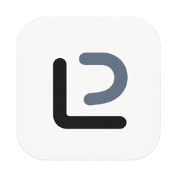
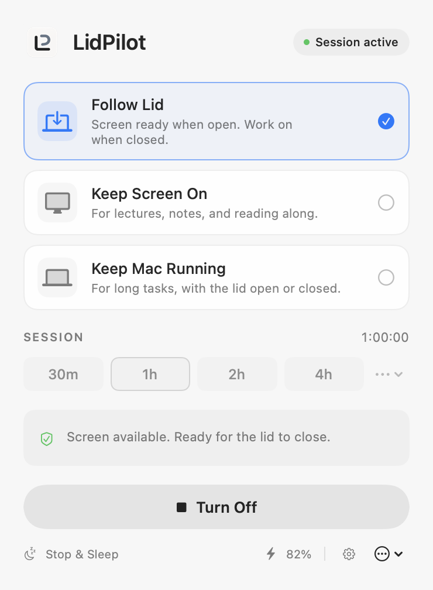

<p align="center"></p>

# LidPilot

**Your Mac. On your time.**

Keep your screen ready for a lecture. Leave a build, download, or local task
running when you close the lid. LidPilot puts both workflows in one native
Mac menu-bar app.

**Free · Open source · Apple Silicon · macOS 15+ · No account · No analytics**

[Website](https://lidpilot.app/) · [Downloads](https://github.com/Marios1111/lidpilot/releases) · [Support](https://github.com/Marios1111/lidpilot/issues) · [MIT license](LICENSE)

<p align="center"></p>

## Get LidPilot

Download [**LidPilot 2.0.1**](https://github.com/Marios1111/lidpilot/releases/download/v2.0.1/LidPilot-2.0.1.dmg),
a Developer ID signed, notarized and stapled app for Apple Silicon.
[Release notes](https://github.com/Marios1111/lidpilot/releases/tag/v2.0.1) ·
[Verification and support boundaries](docs/VERIFICATION.md)

1. Download the DMG from the release page and move **LidPilot.app** to **Applications**.
2. Open LidPilot and choose a mode and session duration.
3. For closed-lid modes, approve its signed helper through **Settings → Helper & Recovery**
   and macOS's background-item approval flow.

LidPilot always starts **Off**, including at login and after an update.
Keep Screen On does not require the helper.

### Homebrew

Install with the project’s Homebrew tap:

```sh
brew install --cask Marios1111/tap/lidpilot
```

Prefer the short command? Add the tap once:

```sh
brew tap Marios1111/tap
brew install --cask lidpilot
```

[Homebrew tap](https://github.com/Marios1111/homebrew-tap) ·
[Setup and required cleanup](docs/HOMEBREW.md)

## New in V2

Keep awake for a command with `lidpilot run`, while independent manual and task
sessions retain their own deadlines. V2 also adds opt-in CLI/JSON control, global
shortcuts, clearer diagnostics, explicit update ownership, experimental Codex and
Claude Code hooks, and refined Settings and menu-bar controls.
See [Developer tools](docs/DEVELOPER_TOOLS.md) for setup and adapter limits.

## Three modes. One place to stay in control.

| Mode | What it does |
| --- | --- |
| **Follow Lid** | Keeps your screen available while open and your Mac running while closed; checks its state again when you reopen. |
| **Keep Screen On** | Keeps your Mac and display awake for lectures, reading, or reference material. Your brightness controls stay available. |
| **Keep Mac Running** | Keeps your Mac working while allowing the display to follow macOS policy. Requires the approved helper. |
| **Off** | Releases LidPilot's wake assertions and verifies cleanup of its owned sleep setting. |

Choose **30 minutes, 1 hour, 2 hours, 4 hours, a custom duration, an end time,
or indefinite**. Switching modes preserves the session deadline. Use **Turn Off**
to end a session, or **Stop & Sleep** to verify cleanup before requesting sleep.

## Built for a quiet menu bar

- Native SwiftUI/AppKit interface, keyboard navigation, and VoiceOver labels.
- Battery cutoff, thermal protection, Low Power Mode and charger policies.
- Clear session, helper, and recovery status; local diagnostic export.
- Optional session-end and safety notifications.
- Launch at login, always Off. Signed Sparkle updates check while Off.

No account, cloud service, analytics SDK, or access to your task contents.
Opt-in command supervision uses process exits; agent adapters use limited lifecycle
events. LidPilot never reads prompts or transcripts to infer completion.

## Know the boundaries

The validated display configuration is the **built-in MacBook display**.
External displays, docks, and virtual displays remain unvalidated. Read the
[support matrix](docs/SUPPORT_MATRIX.md) for the exact tested hardware and OS.

Keeping the display awake also suppresses macOS's native idle dimming. Manual
brightness remains available. After closing the lid, the built-in screen may
take time to go dark—about a minute in recorded tests. LidPilot does not promise
instant electrical panel shutdown.

Keep a running Mac on a stable, ventilated surface. Battery and thermal
safeguards are a backstop, not permission to run it inside a bag. A safety pause
requires an explicit restart. Unknown or stale required state prevents activation.

LidPilot cleans up only state it owns. Other apps can still keep your Mac awake;
Off does not override them or guarantee the whole Mac is asleep.

## Updates and uninstalling

Choose **In-app (Sparkle)**, **Homebrew**, or **Manual** in Settings → Updates.
Homebrew installs default to Homebrew ownership, with Sparkle checks disabled.
In-app installation verifies cleanup and requires an open lid; updates start Off.

Before removing or externally replacing LidPilot:

1. Turn it Off and wait for confirmed cleanup.
2. Disable **Launch at login** in Settings.
3. Choose **Remove Helper…** in **Helper & Recovery** and wait for removal.
4. Quit LidPilot, then remove or replace the app.

This also applies before Homebrew uninstall, reinstall, or an upgrade that
replaces the app. Resolve recovery warnings first. See [Uninstall](docs/UNINSTALL.md),
[Recovery](docs/RECOVERY.md), and [Homebrew](docs/HOMEBREW.md).

## Build and contribute

Development happens on `dev`. The app uses Swift 6, SwiftUI/AppKit, IOKit,
ServiceManagement, authenticated XPC, and Sparkle 2. A narrow signed helper
controls one fixed sleep override; clients cannot submit shell commands.
Read [Architecture](docs/ARCHITECTURE.md) and [Safety](docs/SAFETY.md) for the contracts.

With Xcode and the repository's pinned project-generator dependencies installed:

```sh
./scripts/build.sh Debug
./scripts/build.sh Release
./scripts/test.sh
./scripts/test-app.sh
./scripts/verify.sh
ruby scripts/generate-project.rb --check
```

Local builds are ad-hoc and are not distributable releases. Normal tests use
in-memory power/helper implementations. `./scripts/smoke-ui.sh` exercises the
isolated Debug UI harness without changing global power settings. Real hardware
tests require a supervised baseline and the [hardware procedure](docs/HARDWARE_VALIDATION.md).

See [CONTRIBUTING](CONTRIBUTING.md) for development, [SECURITY](SECURITY.md) for
private vulnerability reporting, [CHANGELOG](CHANGELOG.md) for changes, and
[Releasing](docs/RELEASING.md) for signing and publication.

## Support LidPilot

LidPilot is free and open source. If you find it useful, you can optionally
[support its development on Ko-fi](https://ko-fi.com/lidpilot).

[](https://ko-fi.com/N2O327N8U3)
