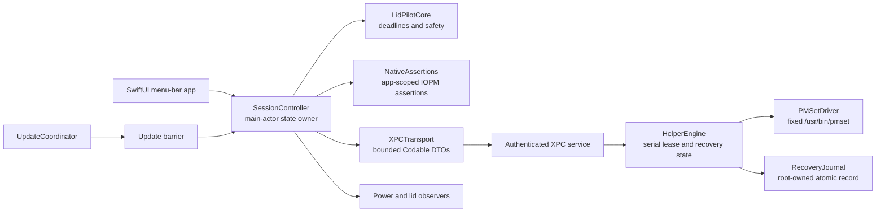

# Architecture

LidPilot is a native Swift 6 application for Apple Silicon Macs running macOS
15 or later. The source is split so policy can be tested without root access or
hardware APIs, while the few operations that can change system sleep behavior
remain behind explicit native boundaries.

This document describes the current development implementation. A component
that has logic and tests is not automatically a release or hardware claim.

## Components and ownership



| Component | Owns | Must not own |
| --- | --- | --- |
| `Core/` | `Mode`, deadlines, snapshots, policy reasons, and typed wire contracts | AppKit, IOKit, shell execution, UI, or root state |
| `App/` | Menu-bar UI, preferences, onboarding, notifications, diagnostics, helper approval, and update UI | Direct power-setting writes or a second session state machine |
| `SessionController` | Requested mode, effective mode, phase, deadline, generation, helper ownership, assertion cleanup, and serialized operations | Physical panel claims or arbitrary helper commands |
| `SystemState`/`StateObserver` | Clock, lid, thermal, battery, Low Power Mode, display topology, wake, sleep, and screen-session observations | Deciding whether a session is safe |
| `NativeAssertions` | App-scoped system/display IOPM assertions and Stop & Sleep | Global `SleepDisabled` mutation |
| `XPCTransport`/`HelperService` | Peer-authenticated, bounded transport and client admission | General IPC or arbitrary data/output paths |
| `HelperEngine` | Lease ownership, generation checks, fixed mutation ordering, watchdog decisions, and recovery status | Network access, prompts, update installation, or arbitrary root commands |
| `PMSetDriver` | Fixed read/write operations and a five-second child-process bound | Caller-selected executable, arguments, shell, or `sudo` |
| `RecoveryJournal` | Root-owned durable intent and confirmed cleanup record | Client-selected locations or silent conflict resolution |
| `UpdateCoordinator` | Sparkle discovery and a barrier around installation-capable checks | Restarting a session or installing while cleanup is uncertain |

## Session and clock model

`SessionController` is `@MainActor` and serializes operation tasks. It keeps
requested mode, effective mode, observed snapshot, helper reply, phase, and
generation separate. The phases are Off, Starting, Active, Stopping, Paused,
Unverified, Recovery, and Updating. UI selection can remain preferred while the session is
Off.

Every start or stop advances the generation. Delayed helper replies check the
captured generation before changing state. Stop, mandatory safety, and deadline
expiry therefore win over a queued Start or late activation response. Switching
mode is a behavior transition that preserves an existing deadline; it does not
construct a new session end time.

`ClockSample` contains continuous seconds, a wall `Date`, and a boot identity.
`SessionDeadline` stores the original sample plus a hard continuous end for
`.seconds`, or a hard absolute end for `.until`. Finite deadlines reject
nonfinite/nonpositive values and expire conservatively on boot mismatch.
Indefinite sessions have no end. `remaining` is bounded by the original finite
duration so a delayed or regressed sample cannot extend a session.

The Core wire request carries the already-built deadline for acquire and renew.
Renewal checks the stored deadline; it never rebuilds one from “now.” The helper
also limits its renewable lease to 60 seconds and the remaining hard deadline.

## Safety and observations

`SystemPowerSampler` uses documented native observation surfaces for lid state,
power source and battery capacity, thermal pressure, Low Power Mode, external
display count, and the sampled sleep flag. Unknown values are represented as
unknown. `SafetyPolicy` rejects stale samples older than 30 seconds, future
samples, boot mismatches, unknown power, and unknown thermal state.

Serious or critical thermal pressure and a discharging battery at or below the
configured 10/20/30% floor block every mode. Smart and Closed additionally need
known lid, Low Power Mode, and display topology; they pause on battery by
default and pause on battery Low Power Mode when configured. Display does not
need the helper and does not pause merely because Low Power Mode is on, but it
still obeys freshness, thermal, power-source, and battery-floor checks.

No policy result implies automatic resume. A safety pause is visible and needs
an explicit user start after the observations recover.

## Native power paths

Display uses `NativeAssertions` with app-scoped
`kIOPMAssertionTypePreventUserIdleSystemSleep` and
`kIOPMAssertionTypePreventUserIdleDisplaySleep`. Assertions are created with a
bounded timeout, renewed while the session is active, read back, and released
on Stop, pause, expiry, sleep, quit, and update preparation. Releasing one
assertion does not release an unrelated process's assertion.

The display assertion is a real native keep-awake mechanism, but it suppresses
the normal idle display sleep/dimming behavior while held. It is not a separate
“dim but never turn off” control. G1 remains open until the desired visual
behavior is measured on supported Macs.

Smart arms its helper lease while the lid is open. While open it may hold the
display assertion; when the lid closes it drops that display assertion while
retaining system wakefulness. On reopen it re-samples safety, topology, and
lease state before restoring display behavior. Closed holds only system
wakefulness and lets display policy follow macOS.

The helper's production driver accepts only:

```text
read:    /usr/bin/pmset -g
enable:  /usr/bin/pmset -a disablesleep 1
restore: /usr/bin/pmset -a disablesleep 0
```

The current code validates the single `SleepDisabled` field, bounds combined
output to 16 KiB, kills and reaps a command after five seconds, and reads back
after mutation. A sampled `on` flag proves only the sampled global setting; it
does not prove physical panel shutdown or exclusive ownership.

## Helper protocol and authentication

The XPC payload is a bounded JSON encoding of `WireRequest`/`WireReply`. Requests
include protocol version, session UUID, nonzero generation, and operation. An
acquire requires a validated deadline, policy, and non-display mode. A renew
must carry the existing deadline; release, inspect, and recover carry no
activation payload. Replies report build, flag, ownership, recovery pending,
lease state, message, success, and an optional snapshot.

The app creates a privileged `NSXPCConnection` only after deriving its own
signing team. It sets a code-signing requirement for the expected helper
identifier and team. The helper sets the reciprocal application requirement,
checks the active console user, allows at most four clients, and admits at most
one outstanding payload globally. Empty or oversized/malformed payloads are rejected
without invoking the engine.

The helper service runs engine work on one serial queue. The watchdog timer is
scheduled independently every ten seconds and calls the engine on that queue.
Every request also checks the watchdog before dispatch, and timer work is coalesced. There is no client request backlog. The app-side heartbeat targets 15 seconds. These are bounded engineering
targets, not real-time guarantees.

## Durable recovery and ownership

The helper writes a versioned recovery record before attempting to enable the
global flag. The production location is fixed under
`/Library/Application Support/LidPilot`; ancestry and ownership are checked,
the directory is restricted, and the file is written through a temporary
no-follow file, `fsync`, rename, and directory `fsync`. A journal record is
evidence of intended ownership and pending cleanup; it cannot make a global
flag exclusive.

Each transaction first acquires a root-owned command-file lock. Fixed POSIX-spawn children retain the helper process group and inherit the lock on stdin. If a child cannot be reaped, the parent closes its copy without unlocking. A later transaction reopens the same verified inode and waits for the child-held lock, so a late enable cannot follow restoration.

The journal distinguishes `prepared`, `enableInFlight`, `enabledVerified`, and explicit `restoreAuthorized` phases. On helper startup, recovery happens before a new lease is accepted. Verified/authorized phases permit restoration; incomplete phases whose flag is on or unknown require explicit recovery. A verified-off incomplete record can be cleared after the command fence settles. A
failed restore retains `ownsOverride` and `recoveryPending`; the watchdog can
retry. A pre-existing or externally changed active flag is a conflict and is
not silently cleared. The app exposes an explicit open-lid recovery action only
after the user acknowledges the ambiguity.

## Update boundary

The generated Xcode project pins Sparkle 2.10.0 and the app configuration
requires signed feeds, pre-extraction verification, daily checks, and manual
installation. Developer builds leave `SUFeedURL` and `SUPublicEDKey` empty.

`UpdateCoordinator` uses one standard Sparkle controller. Both automatic and
manual checks wait until Off. The install-capable callback rejects installation unless the app is Off, the update barrier is held, the lid
is open, assertions are off, and helper registration is absent or known stale.
For a manual check it holds the barrier, performs verified cleanup, unregisters
the helper, records interrupted-update state, and restores the helper after a
cancelled/no-update cycle. An interrupted staged update keeps the barrier until
the user resolves it. A committed update restarts the new app Off.

Signed archives, feed/notes, Developer ID identities, notarization, real helper
replacement, and an update smoke test remain release gates. See
[`docs/RELEASING.md`](RELEASING.md).

## Development and production isolation

Release retains the published identities `com.lidpilot.app` and
`com.lidpilot.app.helper`. Debug uses `com.lidpilot.app.dev` and
`com.lidpilot.app.dev.helper`. Bundle metadata, daemon label/plist, Mach service,
and reciprocal signing requirements must match one exact known pair. Unknown
or mixed identities fail closed; production never accepts a development client.
The publisher Team requirement is unchanged.

UserDefaults follows the distinct app bundle IDs. Diagnostics and recovery
journals use separate `LidPilot` and `LidPilot Development` directories. Both
helpers deliberately share the production `command.lock`: `SleepDisabled` is a
single system-wide flag, so separate identities do not create separate power
ownership. The shared fence serializes preflight/mutation/read-back transactions;
an already-active unowned flag remains a conflict, not an invitation to clear it.

The generator embeds only the selected configuration's daemon plist, checks all
matching IDs, and removes a stale other-configuration plist only from the build
product. Development builds disable Sparkle and do not install production feeds.
Package/test evidence is distinct from live signed-helper coexistence.

## Verification boundary

Core and Runtime tests use mocks for time, power state, assertions, helper
transport, driver writes, and journal faults. They cover generation races,
deadline expiry, thermal/charger changes, replay/ownership rejection, failed
read-back, helper restart, journal corruption, and update barriers.

Those tests do not prove native inactivity dimming, physical internal-panel
power, real signed XPC identity, launchd fault behavior, battery/thermal
behavior across every Mac, or a notarized upgrade/uninstall lifecycle. The
opt-in evidence plan is in [`docs/HARDWARE_VALIDATION.md`](HARDWARE_VALIDATION.md),
and the supported boundary is in [`docs/SUPPORT_MATRIX.md`](SUPPORT_MATRIX.md).

## Out of scope for V1

There is no general-purpose root command API, browser/web UI, analytics,
account, cloud service, CLI, AI-agent detection, transcript access, process
automation, remote control, Shortcuts action, widget, brightness write, fake
input, or blanket external-display blanking path.
